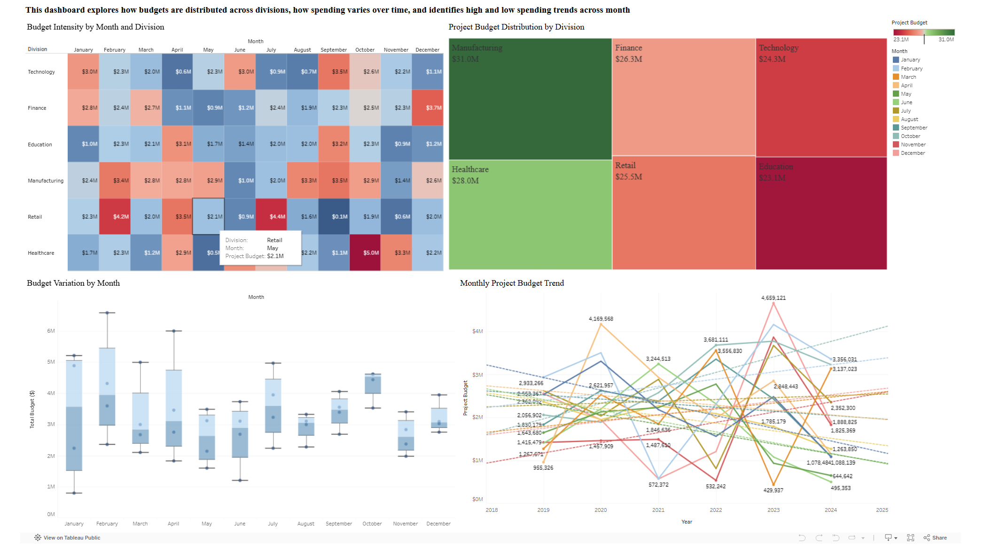
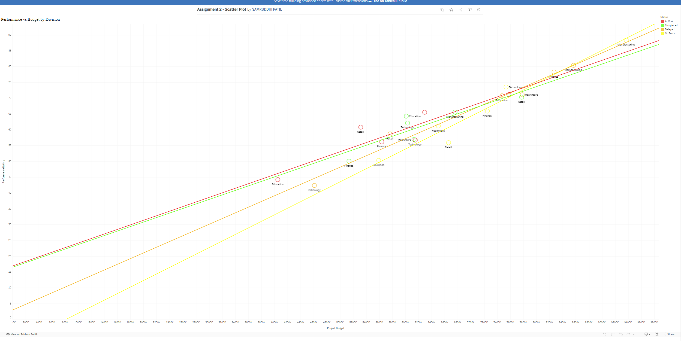
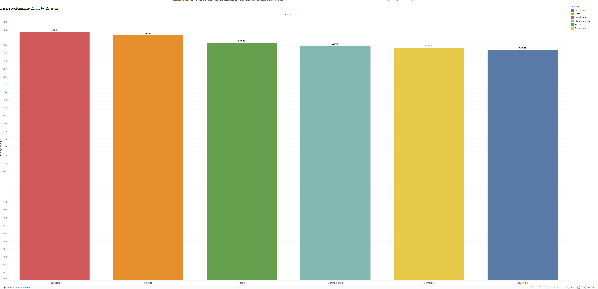
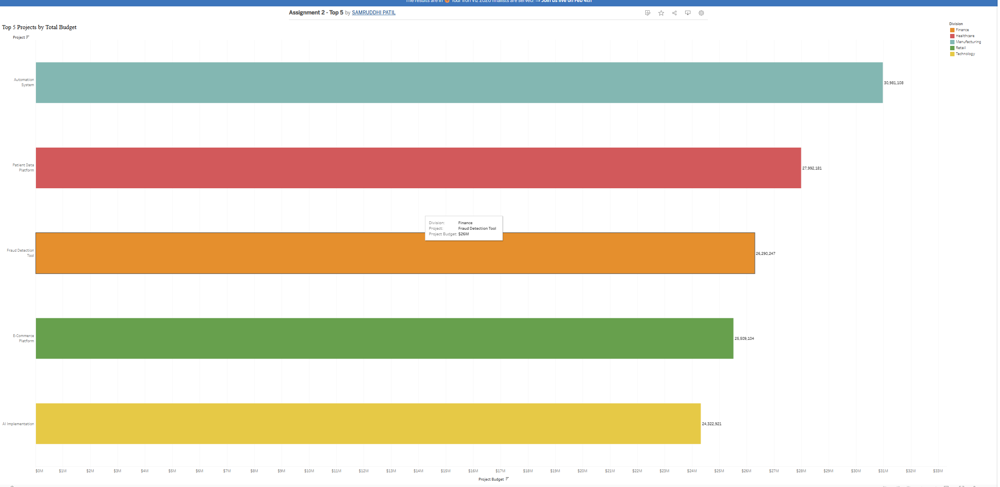
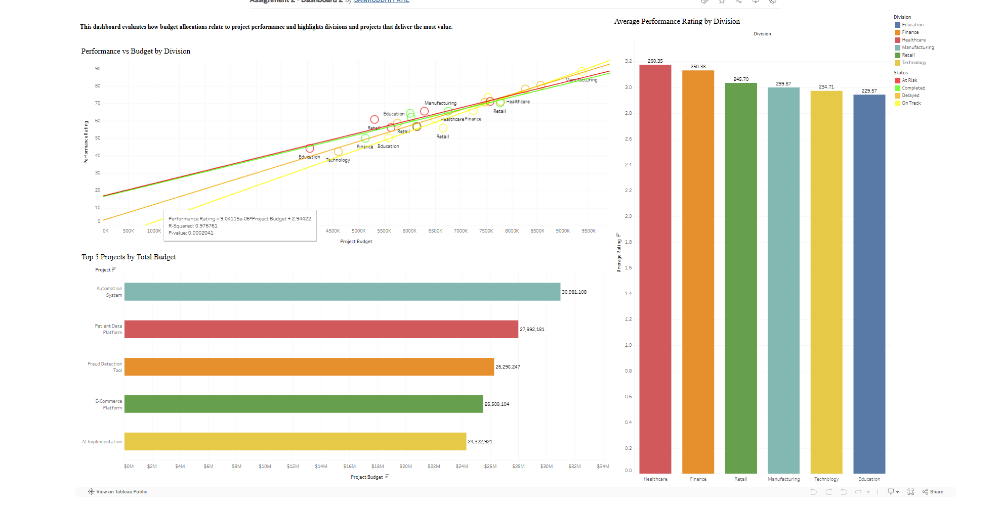

📊 Budget Allocation & Performance Analytics Using Tableau
________________________________________
🚀 Project Overview

This project analyzes how organizational budgets are allocated, utilized, and translated into performance outcomes across multiple divisions and time periods. Using interactive Tableau dashboards, the analysis explores spending intensity, budget variability, performance efficiency, and ROI alignment to support data-driven strategic decision-making.

The objective is to help stakeholders:

•	Understand where budgets are concentrated

•	Identify high-risk, high-variance spending periods

•	Evaluate whether higher investment leads to better performance

•	Highlight high-value divisions and projects
________________________________________
📂 Repository Structure
1.	├── README.md
2.	├── heatmap.png
3.	├── boxplot.png
4.	├── linechart.png
5.	├── Treemap.png
6.	├── performance_scatter.png
7.	├── performance_bar.png
8.	├── top5_projects.png
9.	├── dashboard1_performance_insights.png
10.	└── dashboard2_performance_insights.png

All images used below are stored directly in the repository root and embedded into this README.
________________________________________

🔗 Live Tableau Dashboards

🔹 Dashboard 1: Budget Utilization & Financial Overview

https://public.tableau.com/app/profile/samruddhi.patil6758/viz/Assignment2-Dashboard1_17598043544720/BudgetUtilizationandFinancialOverview?publish=yes

🔹 Dashboard 2: Performance & Strategic Insights

https://public.tableau.com/app/profile/samruddhi.patil6758/viz/Assignment2-Dashboard2_17598044049450/PerformanceStrategicInsights?publish=yes
________________________________________
📘 Dashboard 1: Budget Utilization & Financial Overview

This dashboard focuses on how budgets are distributed and how spending varies across divisions and months. It helps identify seasonal trends, volatility, and concentration of financial resources.

📊 Budget Intensity by Month & Division (Heatmap)

Insight:
The heatmap highlights seasonal budget patterns across divisions. Darker shades indicate higher spending, revealing sustained investment in Manufacturing and Healthcare during peak months, while Education and Technology show more moderate allocation patterns.
________________________________________
📦 Budget Variation by Month (Box Plot)

Insight:
This box plot visualizes month-to-month budget dispersion. Months with wider interquartile ranges and outliers indicate higher spending volatility, signaling periods of increased financial risk that may require tighter governance.
________________________________________
📉 Monthly Project Budget Trend

Insight:
The trend chart tracks how project budgets evolve, exposing growth cycles, downturns, and recovery phases. This view supports long-term forecasting and capacity planning discussions.
________________________________________
🌳 Project Budget Distribution by Division (Treemap)

Insight:
The treemap provides a portfolio-level view of total budget allocation. Manufacturing and Healthcare dominate overall spending, confirming their role as core investment areas, while other divisions operate under tighter budget constraints.

________________________________________
🧩 Dashboard 1 – Overview

This consolidated dashboard enables users to explore budget patterns interactively by division, month, and project.

________________________________________
📕 Dashboard 2: Performance & Strategic Insights

This dashboard evaluates how budget allocation translates into project performance and highlights divisions and initiatives delivering the most value.

🎯 Performance vs Budget by Division (Scatter Plot)

Insight:
The scatter plot demonstrates a strong positive correlation between project budget and performance rating. The upward trend suggests that higher investment generally leads to improved outcomes, supporting ROI-driven budgeting decisions.
________________________________________
⭐ Average Performance Rating by Division

Insight:
Healthcare and Finance lead in average performance ratings, indicating efficient utilization of allocated budgets. Education ranks lower, highlighting opportunities for performance improvement or resource reallocation.
________________________________________
🏆 Top 5 Projects by Total Budget

Insight:
This chart isolates the highest-investment projects such as Automation Systems and Patient Data Platforms. These initiatives require executive oversight due to their large financial commitments and potential ROI impact.
________________________________________
🧩 Dashboard 2 – Overview
This dashboard integrates performance and budget metrics into a single strategic view for leadership decision-making.

________________________________________
✅ Conclusion & Key Takeaways

•	Budget allocation and performance show clear alignment, though efficiency varies across divisions

•	Certain months exhibit high budget volatility, increasing financial risk exposure

•	High-budget projects require continuous performance monitoring

•	Data-driven insights can support smarter reallocation and optimization of resources

This project demonstrates how visual analytics and storytelling can transform raw financial data into actionable business insights.
________________________________________

👩‍💻 Author
Samruddhi Patil

MS Business Analytics

Tableau | Data Visualization | Strategic Analytics

Tableau Public: https://public.tableau.com/app/profile/samruddhi.patil6758

